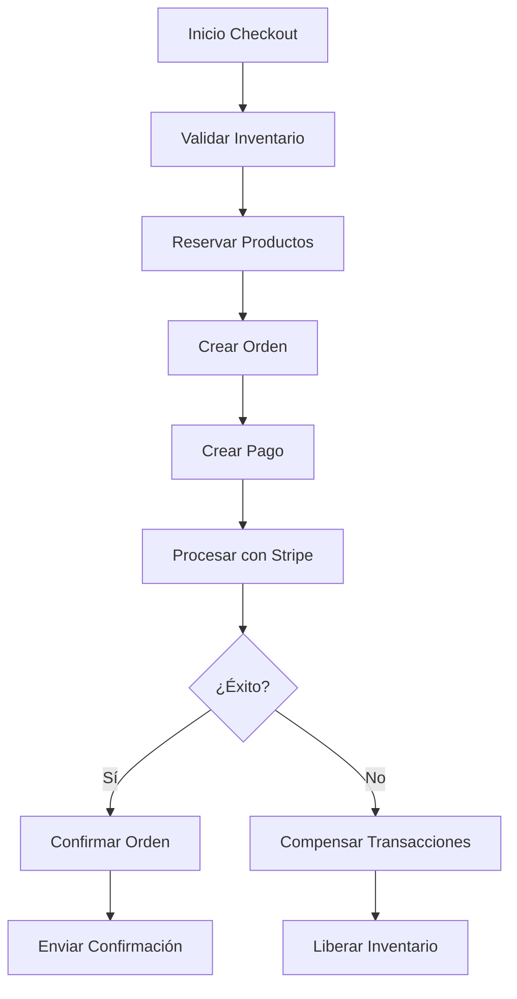

# Flujo de Pagos Profesional y Optimizado

## Arquitectura Recomendada

### 1. **Patrón Saga para Transacciones Distribuidas**


### 2. **Estados de Pago Granulares**
```python
class PaymentStatus(models.TextChoices):
    PENDING = 'pending', 'Pendiente'
    PROCESSING = 'processing', 'Procesando'
    AUTHORIZED = 'authorized', 'Autorizado'
    COMPLETED = 'completed', 'Completado'
    FAILED = 'failed', 'Fallido'
    CANCELLED = 'cancelled', 'Cancelado'
    REFUNDED = 'refunded', 'Reembolsado'
    PARTIALLY_REFUNDED = 'partially_refunded', 'Parcialmente Reembolsado'
    DISPUTED = 'disputed', 'Disputado'
```

### 3. **Circuit Breaker Pattern**
```python
class StripeCircuitBreaker:
    def __init__(self, failure_threshold=5, recovery_timeout=60):
        self.failure_threshold = failure_threshold
        self.recovery_timeout = recovery_timeout
        self.failure_count = 0
        self.last_failure_time = None
        self.state = 'CLOSED'  # CLOSED, OPEN, HALF_OPEN
    
    def call(self, func, *args, **kwargs):
        if self.state == 'OPEN':
            if time.time() - self.last_failure_time > self.recovery_timeout:
                self.state = 'HALF_OPEN'
            else:
                raise CircuitBreakerOpenException()
        
        try:
            result = func(*args, **kwargs)
            self.on_success()
            return result
        except Exception as e:
            self.on_failure()
            raise e
```

### 4. **Cache Inteligente**
```python
class PaymentCache:
    def __init__(self):
        self.cache = cache
    
    def get_payment_methods(self, user_id):
        cache_key = f"payment_methods_{user_id}"
        methods = self.cache.get(cache_key)
        if not methods:
            methods = PaymentMethod.objects.filter(is_active=True)
            self.cache.set(cache_key, methods, timeout=3600)
        return methods
    
    def invalidate_payment_methods(self, user_id):
        cache_key = f"payment_methods_{user_id}"
        self.cache.delete(cache_key)
```

### 5. **Logging Estructurado**
```python
import structlog

logger = structlog.get_logger()

def create_payment_with_logging(order, amount, payment_method):
    logger.info(
        "payment_creation_started",
        order_id=order.id,
        amount=amount,
        payment_method=payment_method,
        user_id=order.user.id
    )
    
    try:
        payment = Payment.objects.create(
            order=order,
            amount=amount,
            payment_method=payment_method
        )
        
        logger.info(
            "payment_created_successfully",
            payment_id=payment.id,
            order_id=order.id
        )
        
        return payment
    except Exception as e:
        logger.error(
            "payment_creation_failed",
            order_id=order.id,
            error=str(e),
            exc_info=True
        )
        raise
```

### 6. **Validación Robusta**
```python
class PaymentValidator:
    @staticmethod
    def validate_amount(amount, currency='USD'):
        min_amount = Decimal('0.50')
        max_amount = Decimal('10000.00')
        
        if amount < min_amount:
            raise ValidationError(f"Amount must be at least {min_amount}")
        if amount > max_amount:
            raise ValidationError(f"Amount cannot exceed {max_amount}")
        
        # Validar formato de moneda
        if currency not in ['USD', 'EUR', 'COP']:
            raise ValidationError(f"Unsupported currency: {currency}")
    
    @staticmethod
    def validate_payment_method(payment_method_id, user):
        try:
            method = PaymentMethod.objects.get(id=payment_method_id, is_active=True)
            return method
        except PaymentMethod.DoesNotExist:
            raise ValidationError("Invalid payment method")
    
    @staticmethod
    def validate_inventory_availability(cart_items):
        for item in cart_items:
            if item.inventory.quantity < item.quantity:
                raise ValidationError(f"Insufficient inventory for {item.inventory.product.name}")
```

### 7. **Manejo de Errores Avanzado**
```python
class PaymentErrorHandler:
    ERROR_MAPPING = {
        'card_declined': 'Tarjeta rechazada',
        'insufficient_funds': 'Fondos insuficientes',
        'expired_card': 'Tarjeta expirada',
        'invalid_cvc': 'CVC inválido',
        'processing_error': 'Error de procesamiento'
    }
    
    @staticmethod
    def handle_stripe_error(stripe_error):
        error_code = stripe_error.code
        user_message = PaymentErrorHandler.ERROR_MAPPING.get(
            error_code, 'Error de pago inesperado'
        )
        
        logger.error(
            "stripe_payment_error",
            error_code=error_code,
            error_message=stripe_error.message,
            user_message=user_message
        )
        
        return {
            'error': user_message,
            'error_code': error_code,
            'retryable': error_code in ['processing_error', 'temporary_error']
        }
```

### 8. **Métricas y Monitoreo**
```python
from prometheus_client import Counter, Histogram, Gauge

# Métricas
payment_attempts = Counter('payment_attempts_total', 'Total payment attempts')
payment_success = Counter('payment_success_total', 'Total successful payments')
payment_failures = Counter('payment_failures_total', 'Total failed payments')
payment_duration = Histogram('payment_duration_seconds', 'Payment processing time')
active_payments = Gauge('active_payments', 'Number of active payments')

class PaymentMetrics:
    @staticmethod
    def record_payment_attempt(payment_method):
        payment_attempts.labels(method=payment_method).inc()
    
    @staticmethod
    def record_payment_success(payment_method, duration):
        payment_success.labels(method=payment_method).inc()
        payment_duration.labels(method=payment_method).observe(duration)
    
    @staticmethod
    def record_payment_failure(payment_method, error_code):
        payment_failures.labels(method=payment_method, error=error_code).inc()
```

### 9. **Flujo Optimizado Completo**
```python
class OptimizedPaymentService:
    def __init__(self):
        self.circuit_breaker = StripeCircuitBreaker()
        self.cache = PaymentCache()
        self.validator = PaymentValidator()
        self.error_handler = PaymentErrorHandler()
    
    @transaction.atomic
    def process_payment(self, user, cart_data, payment_method_id):
        start_time = time.time()
        
        try:
            # 1. Validaciones
            self.validator.validate_payment_method(payment_method_id, user)
            self.validator.validate_inventory_availability(cart_data['items'])
            
            # 2. Reservar inventario
            self.reserve_inventory(cart_data['items'])
            
            # 3. Crear orden
            order = self.create_order(user, cart_data)
            
            # 4. Crear pago
            payment = self.create_payment(order, cart_data['total'], payment_method_id)
            
            # 5. Procesar con Stripe (con circuit breaker)
            stripe_session = self.circuit_breaker.call(
                self.create_stripe_session, order, payment
            )
            
            # 6. Registrar métricas
            duration = time.time() - start_time
            PaymentMetrics.record_payment_success(payment_method_id, duration)
            
            return stripe_session
            
        except Exception as e:
            # 7. Manejo de errores y compensación
            self.handle_payment_error(e, order, cart_data)
            PaymentMetrics.record_payment_failure(payment_method_id, str(e))
            raise
```

## Beneficios del Flujo Optimizado

1. **Alta Disponibilidad**: Circuit breaker previene cascadas de fallos
2. **Performance**: Cache reduce latencia y carga de BD
3. **Observabilidad**: Logging y métricas para debugging
4. **Escalabilidad**: Patrón Saga para transacciones distribuidas
5. **Seguridad**: Validaciones robustas y auditoría
6. **Mantenibilidad**: Código modular y testeable
7. **Experiencia de Usuario**: Manejo inteligente de errores
8. **Monitoreo**: Métricas en tiempo real para alertas

## Implementación Gradual

1. **Fase 1**: Implementar logging estructurado y métricas
2. **Fase 2**: Agregar circuit breaker y cache
3. **Fase 3**: Mejorar validaciones y manejo de errores
4. **Fase 4**: Implementar patrón Saga
5. **Fase 5**: Optimizar performance y escalabilidad 