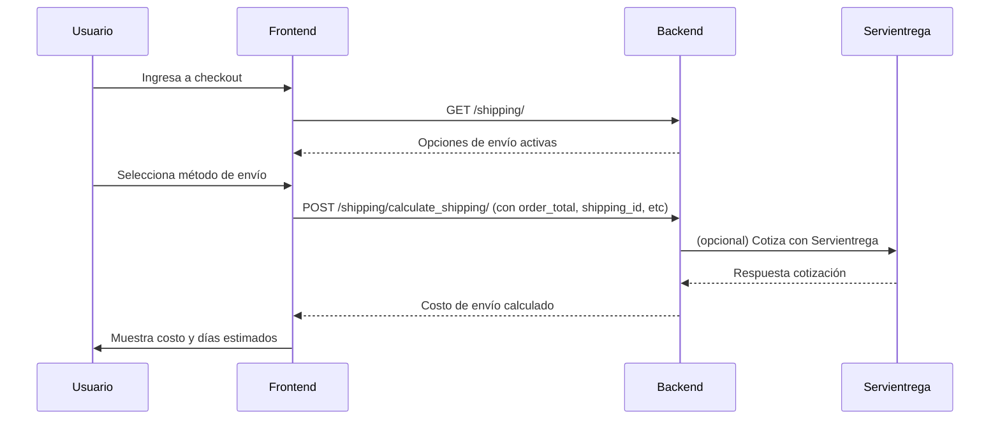

# 📦 Flujo de Envíos (Shipping) - Documentación Técnica

## Índice
1. [Backend (Django REST Framework)](#backend)
    - Modelos
    - Serializers
    - Servicios externos
    - Vistas y endpoints
    - Rutas
    - Admin
2. [Frontend (Next.js/React)](#frontend)
    - Componentes y hooks
    - Integración con Redux
    - Flujo de usuario
3. [Secuencia de interacción](#secuencia)
4. [Notas y recomendaciones](#notas)

---

## 1. Backend (Django REST Framework)

### **Modelo: `Shipping`**
- Define los métodos de envío disponibles.
- Campos clave:
  - `name`, `service_type`, `transport_type`, `is_active`
  - `free_shipping_threshold`: monto mínimo para envío gratis.
  - `standard_shipping_cost`: costo estándar.
- Métodos:
  - `calculate_shipping_cost(subtotal)`: retorna 0 si el subtotal supera el umbral de envío gratis, si no retorna el costo estándar.
  - `get_estimated_delivery_days()`: días estimados según tipo de servicio.

### **Serializers**
- `ShippingSerializer`: expone los campos del modelo y agrega:
  - `is_free_shipping`: calculado según el total de la orden.
  - `estimated_delivery_days`: días estimados de entrega.
- `ShippingCalculationSerializer`: valida los datos para calcular el envío (`order_total`, `shipping_id`, `weight`, `origin_code`).

### **Servicios externos**
- `ServientregaService`: integra con la API de Servientrega para:
  - Cotizar envíos (`cotizar_envio`)
  - Generar guías (`generar_guia`)
  - Consultar estado de guías y validar códigos postales.

### **Vistas y endpoints**
- `ShippingViewSet` (usa `ModelViewSet`):
  - `list`: lista métodos de envío activos (`GET /shipping/`)
  - `retrieve`: detalles de un método de envío (`GET /shipping/{id}/`)
  - `calculate_shipping`: calcula el costo de envío (`POST /shipping/calculate_shipping/`)
    - Si el usuario está autenticado y hay datos, consulta cotización real a Servientrega.
    - Si no, usa la lógica local del modelo.

### **Rutas**
- Definidas en `shipping/urls.py`:
  - `/shipping/` → lista y detalle de métodos de envío.
  - `/shipping/calculate_shipping/` → cálculo de envío.

### **Admin**
- Permite gestionar métodos de envío desde el panel de Django.
- Filtros por tipo de servicio, transporte y estado.

---

## 2. Frontend (Next.js/React)

### **Componentes y hooks**
- **CheckoutWrapper**: envuelve el proceso de checkout con contexto.
- **CheckoutDetails**: orquesta el flujo de checkout, incluyendo selección de envío, cupón y resumen de orden.
- **Shipping**: muestra las opciones de envío y permite seleccionarlas. Al seleccionar, llama a la API para calcular el costo real.
- **Redux slices**:
  - `cartApiSlice`: define los endpoints para obtener opciones de envío y calcular el costo (`useGetShippingOptionsQuery`, `useCalculateShippingMutation`).
  - `paymentApiSlice`: obtiene el total a pagar considerando el envío.

### **Flujo de usuario**
1. El usuario entra al checkout.
2. Se muestran las opciones de envío (`GET /shipping/`).
3. Al seleccionar una opción, se calcula el costo real (`POST /shipping/calculate_shipping/`).
4. El usuario ve el costo actualizado y puede proceder al pago.

---

## 3. Secuencia de interacción

---

## 4. Notas y recomendaciones

- El backend permite extender la lógica para otros proveedores de envío.
- El frontend está desacoplado: puede mostrar nuevas opciones de envío sin cambios mayores.
- El cálculo de envío es reactivo: cada vez que el usuario cambia la opción, se recalcula y actualiza el total.
- El admin permite gestionar fácilmente los métodos de envío y sus parámetros. 